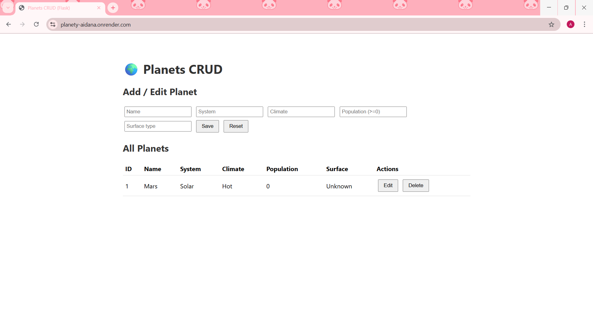

# Mini projekt CRUD – Planety

Projekt wykonany w ramach zadania **„CRUD × 2 encje” (część A)**.  
Aplikacja webowa napisana w **Python (Flask)** z wykorzystaniem **SQLite**.  
Umożliwia pełną obsługę CRUD (Create, Read, Update, Delete) dla encji **Planeta**.

---

## Cel projektu
Celem projektu jest stworzenie aplikacji webowej z pełnym przepływem:
**baza danych → REST API → prosty frontend (HTML/JS)**.

Aplikacja realizuje wszystkie wymagania etapu **A**:
- relacyjna baza danych z migracją przy starcie (SQLite),
- REST API z poprawnymi kodami HTTP i walidacją danych,
- prosty interfejs HTML pozwalający na dodawanie, edytowanie i usuwanie rekordów,
- README z instrukcją uruchomienia projektu w laboratorium.

---

## Technologie
- **Backend:** Python, Flask, Flask-Cors  
- **Baza danych:** SQLite  
- **Frontend:** HTML, JavaScript (fetch API)

---

## Struktura projektu
```
planets-python/
├─ backend/
│  ├─ app.py
│  ├─ database.py
│  ├─ planets.py
│  └─ validators.py
├─ frontend/
│  └─ index.html
└─ requirements.txt
```

---

## Uruchomienie projektu lokalnie
1. Zainstaluj Python 3.10+  
2️. W folderze projektu utwórz i aktywuj wirtualne środowisko:

```bash
python -m venv .venv
# Aktywacja:
# Windows:
. .\.venv\Scripts\Activate.ps1
# macOS / Linux:
source .venv/bin/activate
```

3️. Zainstaluj wymagane biblioteki:
```bash
pip install -r requirements.txt
```

4️. Uruchom aplikację:
```bash
python -m backend.app
```

5️. Otwórz w przeglądarce:  
[https://planety-aidana.onrender.com/](https://planety-aidana.onrender.com/)

> Przy pierwszym uruchomieniu zostanie automatycznie utworzona baza danych `planets.db`.

---

## Endpointy REST API

| Metoda | Endpoint | Opis | Kod odpowiedzi |
|--------|-----------|------|----------------|
| `GET` | `/planets` | Zwraca listę wszystkich planet | 200 |
| `GET` | `/planets/<id>` | Zwraca szczegóły planety o podanym ID | 200 / 404 |
| `POST` | `/planets` | Dodaje nową planetę | 201 / 400 |
| `PUT` | `/planets/<id>` | Aktualizuje dane planety | 200 / 400 / 404 |
| `DELETE` | `/planets/<id>` | Usuwa planetę | 200 / 404 |

### 🔹 Przykładowe dane (POST/PUT)
```json
{
  "name": "Tatooine",
  "system": "Outer Rim",
  "climate": "Arid",
  "population": 200000,
  "surfaceType": "Desert"
}
```

---

## Walidacja danych
Plik `validators.py` sprawdza:
- wymagane pola (`name`, `system`, `climate`, `surfaceType`),
- poprawny typ liczbowy dla `population`,
- unikalność planety w obrębie danego systemu,
- że `population >= 0`.

---

## Frontend
Plik `frontend/index.html` umożliwia pełną obsługę CRUD:
- dodawanie nowych planet,  
- edycję istniejących,  
- usuwanie wpisów,  
- przeglądanie wszystkich danych w tabeli.

Komunikacja odbywa się przez REST API (`fetch()`).

---

## Aplikacja online
Projekt działa publicznie pod adresem:  
[https://planety-tanaiym.onrender.com](https://planety-tanaiym.onrender.com)

---

## 🖼️ Zrzut ekranu


---

## Wersje
- `v0.1-A` – część A (moja encja: Planeta)  
- `v0.2-B` – część B (rozszerzenie modułu partnera)

---

## Autor
Aidana Abylkasymova  
id 69486