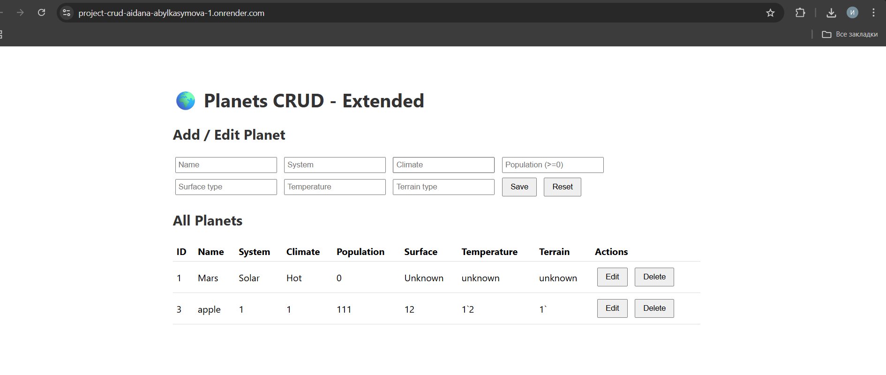

# Planets CRUD - Wymaganie B (rozszerzenie modułu partnera)

## 1. Uruchomienie lokalnie

1. Przejdź do katalogu backend:
   cd backend
2. Zainstaluj zależności:
   pip install -r ../requirements.txt
3. Uruchom serwer:
   python app.py
4. Otwórz przeglądarkę:
   https://project-crud-aidana-abylkasymova-1.onrender.com/
- Frontend pozwala na pełny CRUD planet z dodatkowymi polami `temperature` i `terrainType`.

## 2. Endpoints API

| Method | Endpoint        | Opis                                 |
|--------|----------------|--------------------------------------|
| GET    | /planets       | Pobierz wszystkie planety             |
| GET    | /planets/:id   | Pobierz planetę po ID                 |
| POST   | /planets       | Dodaj nową planetę (z nowymi polami) |
| PUT    | /planets/:id   | Edytuj planetę                        |
| DELETE | /planets/:id   | Usuń planetę                          |

### Walidacja pól:
- name (TEXT) - wymagany  
- system (TEXT) - wymagany  
- climate (TEXT) - wymagany  
- population (INTEGER) - wymagany, >=0  
- surfaceType (TEXT) - wymagany  
- temperature (TEXT) - wymagany  
- terrainType (TEXT) - wymagany  

### Kody HTTP:
- 200 OK - operacja zakończona powodzeniem (GET, PUT, DELETE)  
- 201 Created - nowa planeta utworzona (POST)  
- 400 Bad Request - brak wymaganych pól lub błędny typ danych  
- 404 Not Found - nie znaleziono planety po ID

## 3. Encja: Planet

| Pole          | Typ       | Opis                     |
|---------------|----------|--------------------------|
| id            | INTEGER  | Klucz główny, autoinkrementacja |
| name          | TEXT     | Nazwa planety           |
| system        | TEXT     | Układ planetarny        |
| climate       | TEXT     | Klimat                  |
| population    | INTEGER  | Populacja (>=0)         |
| surfaceType   | TEXT     | Typ powierzchni         |
| temperature   | TEXT     | Temperatura             |
| terrainType   | TEXT     | Typ terenu              |
| created_at    | TEXT     | Data utworzenia         |
| updated_at    | TEXT     | Data ostatniej aktualizacji |

## 4. Zrzut ekranu UI

- Formularz CRUD obsługuje nowe pola `temperature` i `terrainType`  
- Lista planet pokazuje wszystkie informacje w tabeli  

## 5. Git / Repo

- Gałąź: feature/add-climate-population  
- Pull Request do main partnera zawiera:
  - opis dodanych pól i celu zmian,
  - instrukcję uruchomienia lokalnego,
  - zrzut ekranu UI  
- Istniejąca funkcjonalność partnera pozostaje nienaruszona
